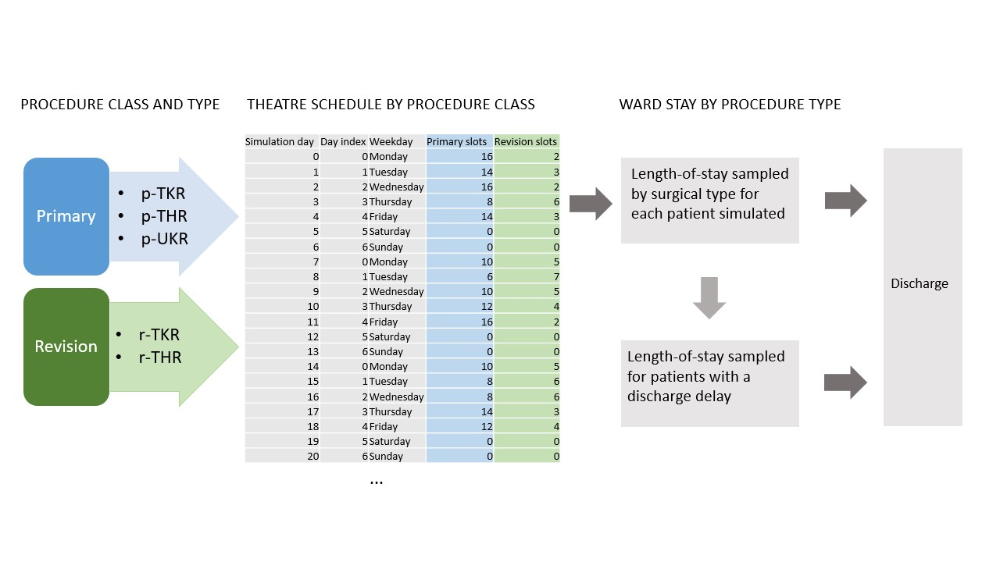
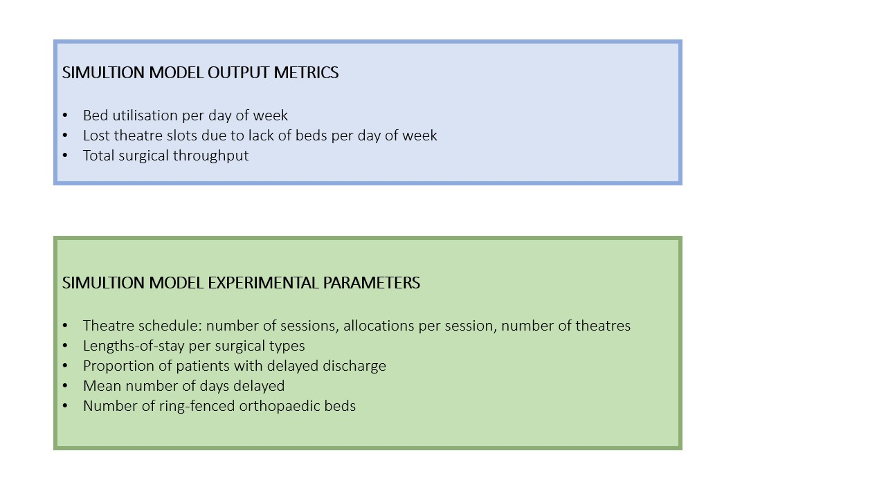

# Hospital Efficiency Project

Hospital Efficiency Project was a 3-year, HDRUK funded project aimed at improving the efficiency of orthopaedic pathways.

The project, completed in March 2023, was a collaboration between the Universities of Bristol and Exeter, and North Bristol NHS Trust.

This work package involved the development of a discrete event simulation model for planning of additional elective orthopaedic capacity to support COVID-19 elective surgical recovery. Capacity is considered in terms of:  

*	Additional resources
*	Efficiency of resource use

The model represents surgical joint replacement activity from theatre scheduling, to ward stay, to discharge for primary and revision hip and knee replacement surgeries, and uni-compartmental knee replacement surgery. 

A web application of the simulation model allows experimenting with theatre schedule, for example investigating the effects of increasing the number of sessions per weekday, or adding weekend sessions, or of scheduling different surgical types across weekdays. Other scenarios can also be investigated, for example the mean lengths-of-stay of different surgical procedures, the number of ward beds available, and the proportion of patients whose discharge is delayed. The impacts of all of these changes can be seen on bed utilisation across weekdays, and total surgical throughput.

See here for the simulation as an online interactive web app: [Hospital Efficiency Project](https://hospital-efficiency-project.streamlit.app/)

